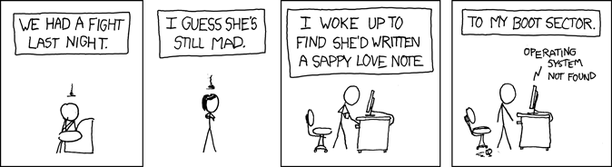
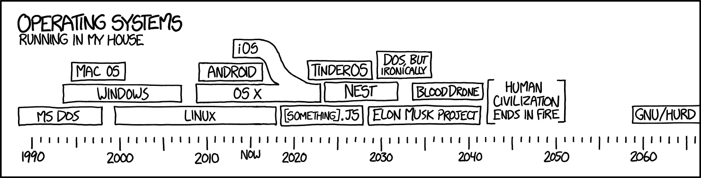

This is the final assignment for the course unit KIK-LG221 "Command Line Tools for Linguists" (5 cr). The aim of this course, among other things, was to  
* teach the students how to use Unix command-line and regular expressions
* introduce the students to basic processing of corpora 
* create and host a webpage on GitHub Pages
* **stay calm** and <ins>google</ins> when things go wrong  

The course material for each week was published on the course's Moodle page on Monday. The students had until Sunday to finish the week's quiz and to upload their homework.
For more information, please visit [the course page](https://studies.helsinki.fi/kurssit/opintojakso/otm-92ee484e-456b-409f-a397-d9d2b6e40a2f/KIK-LG221). 



## Week 1: Introduction to Command Line Environments  
This week involved **setting up and launching the command-line in Windows and MacOS** as well as going through **basic command line commands**.

Commands introduced: <kbd>ls</kbd>, <kbd>pwd</kbd>, <kbd>whoami</kbd>, <kbd>wget</kbd>, <kbd>mv</kbd>, <kbd>cat</kbd>, <kbd>less</kbd>, <kbd>cp</kbd>, <kbd>rm</kbd>, <kbd>mkdir</kbd>, <kbd>cd</kbd>, <kbd>q</kbd>, <kbd>Esc</kbd>, <kbd>Ctrl-c</kbd>, <kbd>Ctrl-d</kbd>, <kbd>Ctrl-x</kbd>, <kbd>nano</kbd>



### Quiz for Week 1 & What I Learned
This week's quiz mostly consisted of True/False questions. Rather than reading about the commands, I decided to try them out for myself to see if they worked as described or not. For instance, in Question 11, I tested the command 
```
echo Hello, World > hello.txt
```
and found that doing this created a text file in my current working directory that said 'Hello, World.' I preferred this method because it was more hands-down and made the learning process more interesting.  
I had some difficulty setting up Ubuntu on my Windows 11. Oftentimes, I had to install some additional files before I could get the commands to work. Thankfully, Ubuntu usually told me directly what command I should use to get the files I needed. Any remaining issues were solved by googling.  

## Week 2: Navigating a UNIX System  
This week's material had to do with **copying, moving and renaming directories, process management**, and **how to connect and work in a remote server**.

Commands introduced: <kbd>cp -R</kbd>, <kbd>rm -R</kbd>, <kbd>rmdir</kbd>, <kbd>which</kbd>, <kbd>top</kbd>, <kbd>&</kbd>, <kbd>fg</kbd>, <kbd>CTRL+Z</kbd>, <kbd>ps</kbd>, <kbd>kill</kbd>, <kbd>ssh</kbd>, <kbd>scp</kbd>


### Quiz for Week 2 & What I Learned
I approached this week's quiz much in the same way I did the previous one, i.e., trying out different options to see which ones yielded the desired outcome. An exception to this was Question 5, in which I simply read about the chmod command and found that 
```
chmod a+r
``` 
was the way to give all users ('a') reading ('r') but not writing ('w') permission.  
I managed to get through this week's material with relative ease. Setting up the CSC remote server access was a little cumbersome but manageable. No extra googling needed for once!

## Week 3: Basic Corpus Processing 
This week's material had to do with **using text processing tools in UNIX, regular expressions and the grep commands to search through lines in a text file**, as well as working with **formatted text files**. 

Commands introduced: <kbd>file</kbd>, <kbd>dos2unix</kbd>, <kbd>iconv</kbd>, <kbd>tr</kbd>, <kbd>sort</kbd>, <kbd>uniq</kbd>, <kbd>egrep</kbd> with <kbd>-w</kbd>, <kbd>-f</kbd>, <kbd>csv</kbd> and <kbd>tsv</kbd> formats, <kbd>cut</kbd>


### Quiz for Week 3 & What I Learned
Starting from this week, the quizzes included questions where we had to come up with our own solutions. For example, in Question 7, we were supposed to find out how many lines in life_of_bee.txt contained a word which started with "pre" and ended in "-ed". The search results had to include words that contained dashes, like "pre-occupied", but not words like "appreciated". To achieve this, I used the following command:  
```
cat life_of_bee.txt | grep -E "\bpre(\w|-)*ed\b" | wc -l
```
This is the point where the material started to get more challenging. If I hadn't already been learning about regular expressions in another course, I probably would have struggled more. The puzzles were fun though :) 

## Week 4: Advanced Corpus Processing
This week's focus was on **combining simple commands into more complex command pipelines** and **the _sed_ command**.

Commands introduced: <kbd>sed</kbd> with <kbd>-n</kbd>, <kbd>-E</kbd>, <kbd>-d</kbd>, <kbd>-p</kbd>, <kbd>-s</kbd>, <kbd>-g</kbd>


### Quiz for Week 4 & What I Learned
This was the week that I struggled the most. Doing the quiz made me realize I had yet to fully internalized the contents of this week or the previous one. Consequently, I had to google a lot and ended up trying many different solutions without fully understanding what I was doing half the time. I also felt like I ran out of time towards the end, although that's mainly due to poor time management. Looking back though, I think this week was essential to my learning process, as going through the correct solutions and trying them for myself made me think about what I was doing wrong and really dig into the material.  

Another thing that made this week's quiz so hard was that it included so many counting questions. Thankfully, the window of accepted answers was quite wide, and absolute precision was thus not necessary to get a passing score. However, I thought it would be interesting to compare the answers I got and see how and why they differed from the correct ones (note that I have only included questions in which my answer was different from the correct one):


| Question Number | My answer | Correct answer | My code                                                           | Model code     |
|     :---:       |   :---:   |      :---:     |      :---:                                                        |     :---:      |
| 1               | 3280      | 3286           | ``` sed -E 's/(Mrs?)\b/\1\./g' ulysses.txt > ulysses_abbr.txt ``` | Same           | 
| 2               | 990       | 57             | ```sed '/[0-9]/d' ulysses.txt > ulysses_nonum.txt```              | ```sed '/\[ [0-9]\+\ ]/d' ulysses.txt > ulysses_nonum.txt``` |
| 4               | 13        | 14             | ``` cat life_of_bee.freq \| grep " 27 " \| wc -l ```              | Same  |
| 5               | 2450      | 2348           | ``` cat life_of_bee.freq \|  awk '$1 % 2 == 0' \| wc -l  ```      | ```cat life_of_bee.freq \| grep "[02468] " \| wc -l  ```| 
| 8               | 122       | 134            | No data ¯\\_(ツ)_/¯                                               | ```grep -E "\bqueen\b" life_of_bee.sent \| wc -l```|
| 9               | 7         | 8              | No data ¯\\_(ツ)_/¯                                               | ```cat life_of_bee.sent \| grep "\bqueen\b.*\bqueen\b" \| wc -l```

In the cases of Question 1 and 4, I got a different answer even though I used the exact same code as the one provided in the model answer. This was also the case in Question 5, although my original code differed somewhat from the model answer. However, my answer remained the same even when I tried the suggested code. As for Questions 8 & 9, while I managed to get an answer that was within the margin of error, I unfortunately can't recall the code I used to get the answers I originally gave in the quiz. I now realize I should have kept some kind of record of exactly what method I used to arrive at the answers I got for each week. Nevertheless, it is interesting I could get so close to the correct answer with what I can only surmise must have been a rather round-about way. 
As for Question 2, I was careless while reading the question and failed to understand that I was only supposed to target the section numbers within brackets, hence the huge discrepancy between the answer I got and the correct one.   

## Week 5: Scripting and Configuration Files
This week, we got into the basics of **scripting, environment variables** and **configuration files**.

Commands introduced: <kbd>chmod u+x</kbd>, <kbd>if</kbd>, <kbd>$?</kbd>, <kbd>$#</kbd>, <kbd>printenv</kbd>, <kbd>echo</kbd>, <kbd>export</kbd>, <kbd>\~/.bashrc</kbd>, <kbd>~/.bash_profile</kbd>, <kbd>source</kbd>, <kbd>alias</kbd>


### Quiz for Week 5 & What I Learned

This week's quiz had us write some short scripts that converted English adjectives to comparatives. However, given the irregularity of English adjectives, there were several rules that needed to be added for the script to work properly. We started with just adjectives that ended in a consonant and moved from there to take into account certain exceptions like 'red' -> 'redder'. The final version of the script read a text file with a list of adjectives and converted all of them into their comparative form: 

```
#!/bin/bash
### BEGIN INFO
# Script:           comparative_step4.sh
# Author:         Sonja Tapio
# Description: This script was designed to read each line of the text file
#              adjectives.txt. It converts the adjectives into their comparative form
#              and is also designed to recognize different adjective types
#              so that each comparative form is formed grammatically.

if [ $# -ne 1 ]; then
  echo "Please provide a text file."
  echo "Usage: $0 <text file.txt>"
  exit 1
fi

filename="$1"

while IFS= read -r line; do
 case "$line" in
  *[e$])
  echo "${line}r"
  ;;
  *[g$])
      if [ ${#line} -eq 3 ] && [ "${line: -1}" == "g" ]; then
          echo "${line}ger"
      else
      echo "${line}er"
      fi
  ;;
  *[t$])
      if [ ${#line} -eq 3 ] && [ "${line: -1}" == "t" ]; then
          echo "${line}ter"
      else
      echo "${line}er"
      fi
  ;;
  *[y$])
  echo "${line%?}ier"
  ;;
 *)
  echo "${line}er"
  ;;
 esac
done < "$filename"
```
As you can see, the script included several conditions, expressed in form of if-else statements; e.g., with three-letter adjectives that ended in the letter 'g' or 't' (```if [ ${#line} -eq 3] && [ "${line: -1}" == "t | g"]```), the comparative form was formed by adding the suffix '-ger' and '-ter' to the word, respectively. The script also included examples of adjectives that ended in the letter 'y' (```*[y$]```) and thus needed to be inflected differently, as well as adjectives that ended in 'e' (```*[e$]```). The script was instructed to print out the comparative form of the input with the echo command.  
I personally found scripting to be great fun. It definitely felt like taking things to the next level and also having more creative freedom with the way you decided to approach things. Even when I ran into a problem that required some googling, it never felt like a chore but rather like fun problem-solving.

## Week 6: Installing and Running Programs
This week was all about **installing programs**, which included **Python packages** and **software libraries**. We also learned how to use **Makefiles**. 

Commands introduced: <kbd>sudo</kbd>, <kbd>su</kbd>, <kbd>whoami</kbd>, <kbd>passwd</kbd>, <kbd>apt-get</kbd>/<kbd>brew</kbd>, <kbd>locate</kbd>, <kbd>python</kbd>, <kbd>pip</kbd>, <kbd>pip install --user</kbd>, <kbd>python -m venv</kbd>, <kbd>virtualenv</kbd>, <kbd>deactivate</kbd>, <kbd>make</kbd>


### Quiz for Week 6 & What I Learned
Given that I'd had to install additional packages since day one to get the commands to work properly, that part of this week's material was rather easy. However, Question 13 of this week's quiz was a bit more challenging. The task was to write a rule that concatenates all the files in the NO_MD_BOOKS into one big file called **data/all.no_md.txt**. To do this, the following rule was added to the Makefile:

```
data/all.no_md.txt: $(NO_MD_BOOKS)

        cat $^ > $@
```

The ```data/all.no_md.txt``` is the target file which is created when running the code. The ```$(NO_MD_BOOKS)``` refers to all the source files whose metadata has been removed using the ```remove_gutenberg_metadata.py``` script listed in the Makefile. The ```cat $^ > $@``` command concatenates the contents of ```$(NO_MD_BOOKS)``` and creates the target file ```data/all.no_md.txt```.  
There were some discrepancies between some of the official answers and the numbers I was getting, even after I tried to copy-paste the solution in my own terminal. After a lot of tweaking, I managed to get my numbers within a two-point difference and decided to call it a day. 

## Week 7: Version Control 
The curriculum for this course culminated with **version control using Git and Github**. 

Commands introduced: <kbd>git --version</kbd>, <kbd>git config</kbd>, <kbd>//add -A</kbd>, <kbd>//commit -m</kbd>, <kbd>//pull</kbd>, <kbd>//push origin main</kbd>, <kbd>//log</kbd>, <kbd>//revert</kbd>, <kbd>//checkout</kbd>, <kbd>//merge</kbd> 


### Quiz for Week 7 & What I Learned 
I'm not going to lie, my first impression of GitHub was not great. It could be that I was just getting tired of having to learn new things this late in the course, but for whatever reason, the beginning was especially rough for me, and I ended up deleting and recreating my first repository ***three times***. On the bright side, by the time I was done with the quiz, basic things like committing and pushing almost felt like second-nature to me, hahah. 
Thankfully in Question 6, we returned to something familiar, namely needing to convert the entire text file to lowercase letters by adding the ```tr 'A-Z' 'a-z'``` line into the src/freqlist.sh script:  

```
#! /bin/bash                                                                                                           

cat $1 |
tr 'A-Z' 'a-z' |
tr -s '[:space:]' '\n' |
tr -d '[:punct:]' |
sort |
uniq -c |
sort -nr > $2
```

Too bad the changes were quickly undone in the next question :p 
## Final Assignment
The final assignment for this course involved the following list of tasks: 
- Creating a webpage using one of the four templates provided by the course instructor which included
    * An introduction with a photo
    * Working links to relevant social media pages
    * List of the uni courses you have taken
    * Links to past and current projects, together with a short description 
    * A CV created using Overleaf
- Adding a markdown file which describes what you learned on the command-line course. 


### What I Learned
To complete the final assignment, we were required to set up Jekyll on our device, which was pretty straightforward thanks to the instructions. I was already familiar with Overleaf from another course, so, while time-consuming, making the CV wasn't all that difficult either. Markdown and creating a webpage, on the other hand, were something completely new to me.  
Overall, this course has been an incredibly valuable learning experience. The material for each week was well-constructed and easy to understand and the teachers were incredibly kind and quick to answer any questions that I might have (and I had a lot of them!). I think this course has provided me with a solid foundation that is definitely going to make it easier for me to tackle any future problems I will undoubtedly encounter in the field of computational linguistics :)  

