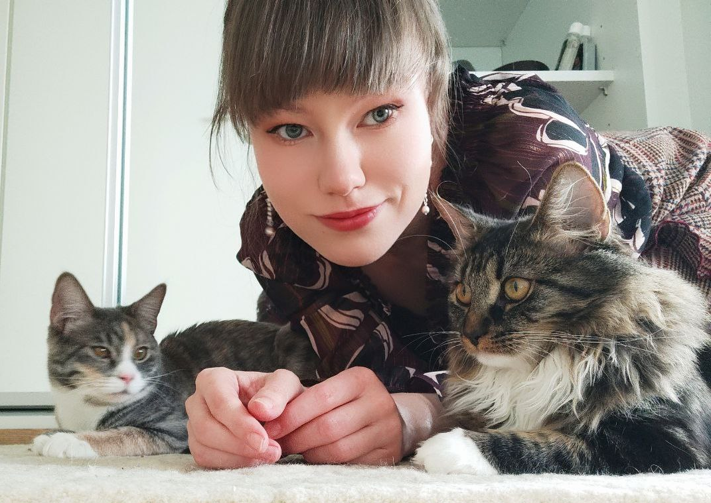

## Introduction

 Hello! My name is Sonja Tapio.   
I am a student at the University of Helsinki as well as the loyal human pet of Misty and Arwen (see our family portrait on the right).  
An avid linguistical enthusiast, I speak five natural languages and have also begun to dabble in a few programming languages.  
After a long and meandering path to graduation, I have finally chosen language technology as my major, for I wish to be a part of developing future  
technologies that will improve human-human communication, regardless of what languages are being spoken.  

## Find me on

[GitHub](https://github.com/SonjaTapio)

## Contact

My email address is sonja.tapio@helsinki.fi. 

## Courses I've Taken

[Introduction to Language Technology](https://studies.helsinki.fi/courses/course-unit/otm-96b452f8-1f60-4696-8f0e-50559973b315), fall 2023

[Introduction to Programming](https://studies.helsinki.fi/courses/course-implementation/otm-a9097bfa-0a37-4f05-b46f-c92fdadd4589), fall 2023

[Command Line Tools for Linguists](https://studies.helsinki.fi/courses/course-unit/otm-92ee484e-456b-409f-a397-d9d2b6e40a2f/KIK-LG221), fall 2023

## Projects

In October 2023, I successfully launched my first GitHub webpage as part of the course 'Command Line Tools for Linguists.' For more information, please click [here](https://github.com/SonjaTapio/SonjaTapio.github.io.git). 

## Misc. 

[My CV](https://www.overleaf.com/read/vjcjtkpkstvv#58e902) 
